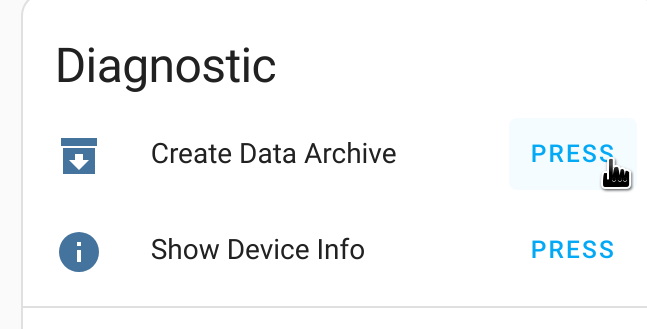

# hon-test-data Collection
Collection of hOn appliance data for development and testing of [TGMivo/pyhOn_copy](https://github.com/TGMivo/pyhOn_copy) and [TGMivo/hon_copy](https://github.com/TGMivo/hon_copy).

## Contribute
Please add your appliances data to this repository. This helps us to develop new features and not to break compatibility in newer versions.   
The data is automatic anonymized (like serial number, mac address, specific dates, given names and any user specific entry).

### Home Assistant 
1. Make sure you installed the [hon integration](https://github.com/TGMivo/hon_copy#readme)
2. Navigate to `Settings` -> `Device & Services` -> `Haier hOn` -> _your device_ and press the _Create Data Archive_ button. Then open notifications to download the data archive.  

    |   |   | 
    |---|---|
4. Create a GitHub Issue to this repository and add this zip file.
    Alternatively create a pull request with unzipped data. 

### pyhOn
1. [Fork](https://github.com/TGMivo/hon-test-data/fork) this repository
2. Clone your forked repository
    ```
    $ git clone https://github.com/YOUR-USERNAME/hon-test-data.git
    $ cd hon-test-data/
    ```
3. Make sure you installed [pyhOn](https://pypi.org/project/pyhOn/)
    ```commandline
    $ pip install pyhOn
    ```
4. Create a export of your data with pyhOn  
    **Make sure you use the anonymous paramater to protect your personal data!**
    ```commandline
    $ pyhOn export --anonymous test_data/
    User for hOn account: your.hon.login@gmail.com
    Password for hOn account: 
    Created test_data/wm_1569/commands.json
    Created test_data/wm_1569/attributes.json
    Created test_data/wm_1569/command_history.json
    Created test_data/wm_1569/statistics.json
    Created test_data/wm_1569/maintenance.json
    Created test_data/wm_1569/appliance_data.json
    ```
5. Commit and push your data
    ```
    $ git add .
    $ git commit -m "Add appliance data"
    $ git push
    ```
6. Create a pull-request to this repository
